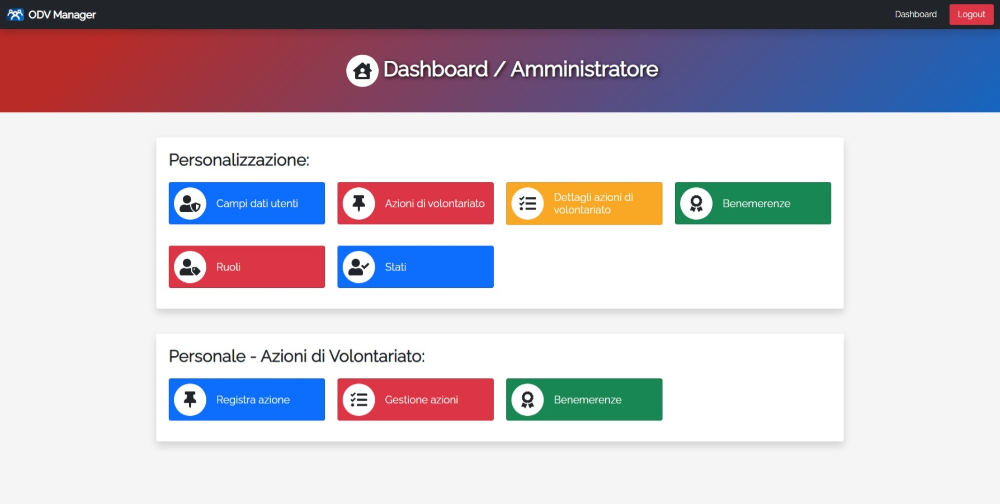
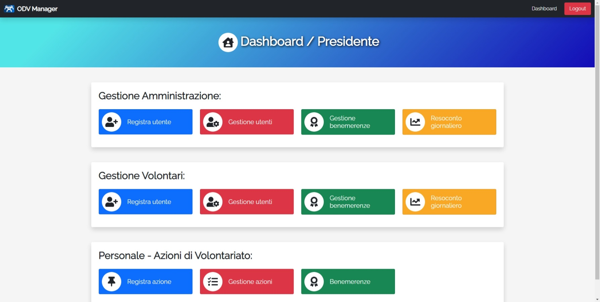
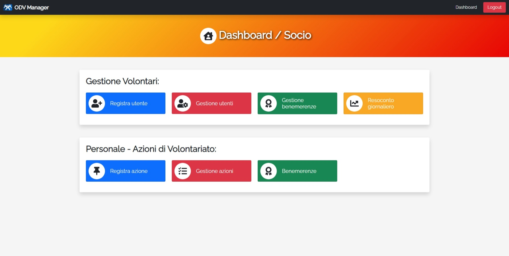
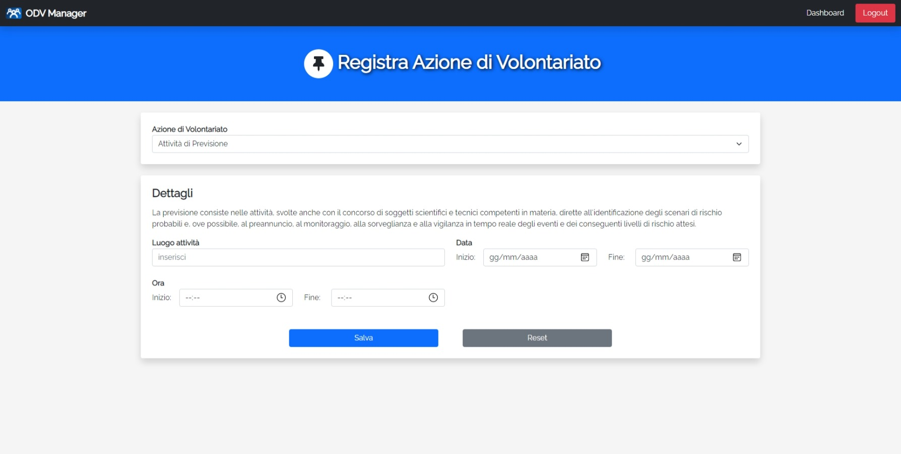

# ODV-Manager

ODV-Manager is a web application for the management of a generic volunteer organization with the ability of dynamic customization based on the requirements.

> UI Language: _Italian_

> [_Live demo_](http://worksofrc.altervista.org/works/ODV-Manager)

## Screenshots

- Login

- Dashboard-Admin

- Dashboard-President

- Dashboard-Associate

- Dashboard-Volunteer

- Record action

