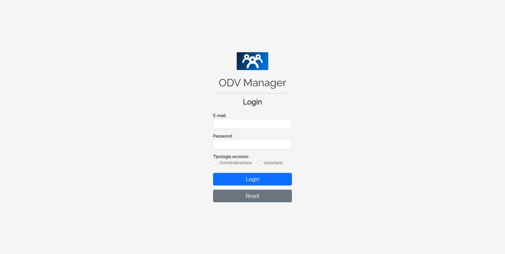

# ODV-Manager

ODV-Manager is a web application for the management of a generic volunteer organization with the ability of dynamic customization based on the requirements.

> Live demo [_here_](http://worksofrc.altervista.org/works/ODV-Manager).

## Screenshots

